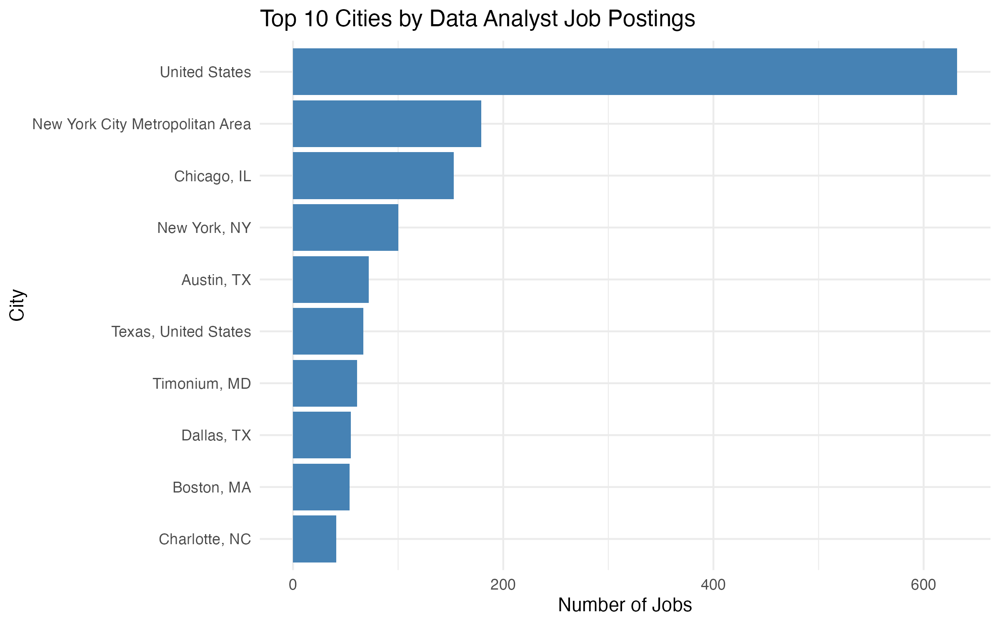
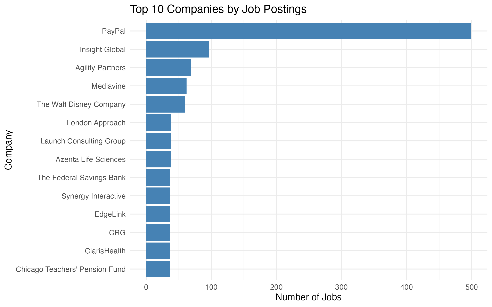
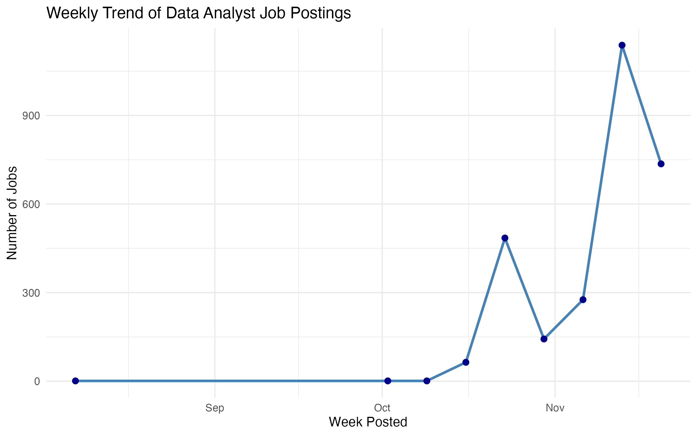
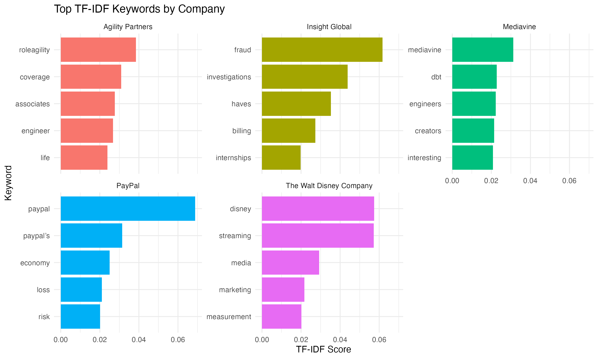

# U.S. Data Analyst Job Market Analysis

This project analyzes over 2,800 LinkedIn job postings for data analyst roles across the United States. It was completed as the capstone for the **Google Advanced Data Analytics Certificate**, with the goal of identifying hiring trends, required skills, and job distribution patterns across locations and companies.

---

## 📌 Objectives

- Identify top skills and tools required for data analyst positions
- Visualize geographic job distribution across cities
- Analyze the proportion of remote, hybrid, and onsite roles
- Discover top hiring companies
- Observe weekly trends in job posting frequency
- Extract distinctive keywords per company using TF-IDF

---

## 📦 Dataset

- **Source**: [Kaggle - LinkedIn Data Analyst Jobs Listings](https://www.kaggle.com/datasets/cedricaubin/linkedin-data-analyst-jobs-listings)
- **Size**: ~2,800 job postings
- **Fields**: title, company, location, description, onsite_remote, posted_date

---

## 🛠️ Tools & Technologies

- **Language**: R
- **Libraries**: `tidyverse`, `ggplot2`, `tidytext`, `wordcloud2`, `lubridate`, `stopwords`
- **Skills demonstrated**: data cleaning, visualization, text mining (TF-IDF), time-series analysis

---

## 📊 Key Visualizations

| Analysis                                | Output                                      |
|-----------------------------------------|---------------------------------------------|
| Top skill keywords (wordcloud)          | [wordcloud.html](visualizations/wordcloud.html) |
| Top 10 cities by job count              |           |
| Remote vs hybrid vs onsite distribution |     |
| Top 10 hiring companies                 |        |
| Weekly job posting trend                |        |
| TF-IDF keywords by company              |       |

---

## 📁 Folder Structure

us-job-market-analysis/
├── data/
│ ├── linkedin-jobs-usa.csv
│ └── cleaned_job_data.csv
├── scripts/
│ ├── 01_data_cleaning.R
│ ├── 02_skill_wordcloud.R
│ ├── 03_city_job_counts.R
│ ├── 04_remote_ratio.R
│ ├── 05_company_rank.R
│ ├── 06_posting_trend.R
│ └── 07_tfidf_keywords.R
├── visualizations/
│ ├── *.png
│ └── wordcloud.html
├── README.md

---

## ▶️ How to Run

1. Clone or download the repository  
2. Open the project in RStudio  
3. Run the scripts inside `/scripts/` in numbered order  
4. All visualizations will be saved to `/visualizations/`

---

## 👤 Author

**Hui Wang**  
Mathematics (Statistics Emphasis), University of Utah  
GitHub: [HazelnutHui](https://github.com/HazelnutHui)
